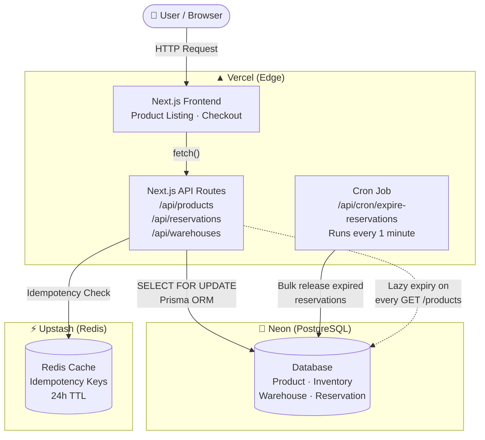

# Allo Inventory — Reservation System

A concurrency-safe inventory reservation system for multi-warehouse fulfillment.

> Built for Allo Health Engineering take-home exercise.

🔗 **Live:** [https://allo-inventory-eight-lac.vercel.app](https://allo-inventory-eight-lac.vercel.app)

---

## Architecture



---
## Screenshots

### Product Listing


### Reserve Dialog


### Reservation Checkout


---

## Tech Stack

| Layer | Tech |
|---|---|
| Framework | Next.js (App Router) |
| Language | TypeScript |
| Database | PostgreSQL (Neon) |
| ORM | Prisma |
| Cache | Redis (Upstash) — idempotency |
| Hosting | Vercel |

---

## Local Setup

```bash
git clone https://github.com/Smatypradish/allo-inventory.git
cd allo-inventory
npm install
cp .env.example .env   # fill in your credentials
npx prisma db push
npm run db:seed
npm run dev
```

Open [http://localhost:3000](http://localhost:3000)

---

## Environment Variables

```env
DATABASE_URL="postgresql://..."
UPSTASH_REDIS_REST_URL="https://..."
UPSTASH_REDIS_REST_TOKEN="..."
RESERVATION_TTL_MINUTES=10
CRON_SECRET="your-secret"
```

---

## API Reference

| Method | Path | Description |
|---|---|---|
| `GET` | `/api/products` | List products with available stock |
| `GET` | `/api/warehouses` | List warehouses |
| `POST` | `/api/reservations` | Reserve units (409 if insufficient stock) |
| `GET` | `/api/reservations/:id` | Get reservation details |
| `POST` | `/api/reservations/:id/confirm` | Confirm purchase (410 if expired) |
| `POST` | `/api/reservations/:id/release` | Release / cancel reservation |
| `GET` | `/api/cron/expire-reservations` | Cron: expire stale reservations |

---

## How It Works

1. **Reserve** — locks units for a configurable TTL (default 10 min) using `SELECT ... FOR UPDATE`
2. **Confirm** — marks units as permanently sold on payment success
3. **Release** — returns units to stock on cancellation or expiry

Concurrent requests for the last unit are serialised at the database level — exactly one gets `201`, the other gets `409`.

Expired reservations are released via:
- **Lazy cleanup** on every `GET /api/products` call
- **Vercel Cron** running every minute

---

## Project Structure

```
allo-inventory/
├── prisma/
│   ├── schema.prisma
│   └── seed.ts
├── src/
│   ├── app/
│   │   ├── page.tsx               # Product listing
│   │   ├── reservation/[id]/      # Checkout + countdown
│   │   └── api/
│   │       ├── products/
│   │       ├── warehouses/
│   │       ├── reservations/
│   │       └── cron/expire-reservations/
│   └── lib/
│       ├── prisma.ts
│       ├── redis.ts
│       ├── validators.ts
│       ├── idempotency.ts
│       └── utils.ts
├── vercel.json
└── .env.example
```
